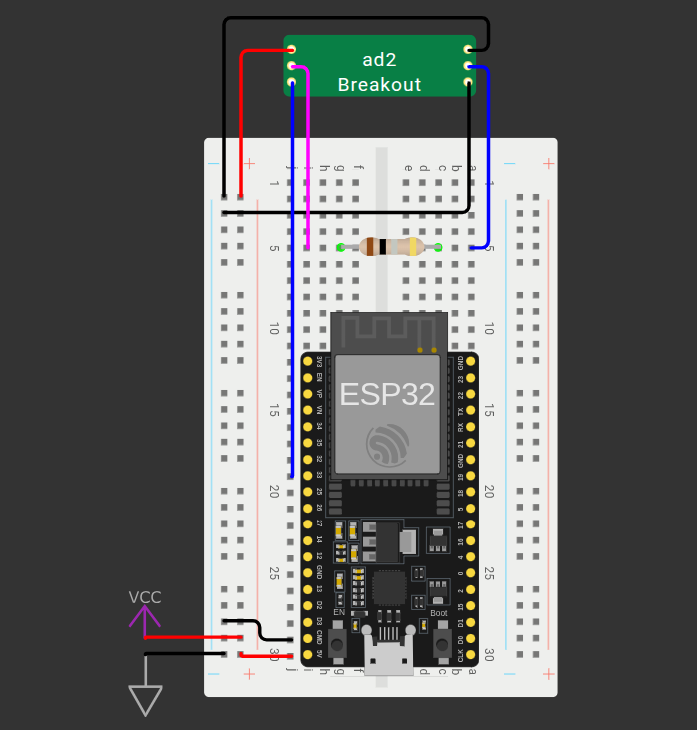

# Measuring

## Purpose
This folder contains a Digilent WaveForms project that measures the total consumed energy of a microcontroller. The microcontroller uses a pin to control measurement, which is set high during recording and low otherwise. 

## How to use
1. Wire the circuit as follows:
     
    

2. Load the WaveForms project file.
3. Run the script contained in the WaveForms file. `oscilliscope_script.txt` is used for reference, but the most updated script is the one in the WaveForms project.